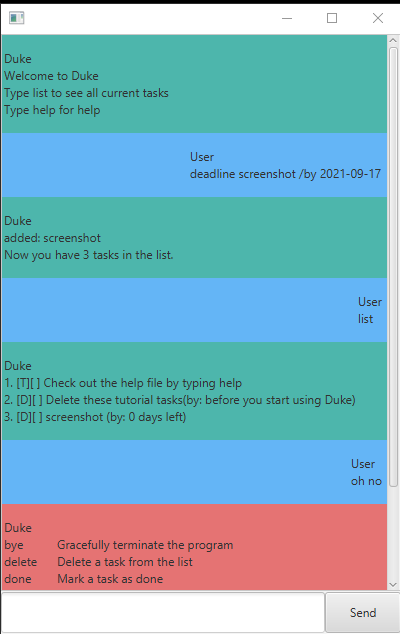

# User Guide

## Quick start
1. Ensure you have Java 11 or above installed in your Computer.
1. Download the latest `Duke.jar` from [here](https://github.com/cookiedan42/ip/releases).
1. Copy the file to the folder you want to use as the home folder for your Duke task manager.
1. Double-click the file to start the app. A gui similar to this will be shown  
   
1. Type `list` to view sample data 
1. Type `help` to view version-specific built-in guide

## Features

## Adding a new Task to the list

### Adding a simple task : `todo`
Add a task with only a name  
Format : `todo TASK_NAME`  
Examples :  
* `todo write documentation`
* `todo eat lunch`
  
### Adding a task with a deadline : `deadline`
Add a task with a name, and a deadline  
Format : `deadline TASK_NAME /by DEADLINE`  
Formatting the deadline as YYYY-MM-DD will display a countdown to that date in the task display  
Examples :
* `deadline write documentation /by release day`
* `deadline buy christmas gifts /by 2021-12-25`  
 
### Adding a task with a start and end : `event`
Add a task with a name, and a start-end time  
Format : `event TASK_NAME /at START_END`
Examples :
* `event write code /at start of module to release day`
* `event celebrate christmas /at 2021-12-25 00:01 to 2021-12-25 23:59`

## Modifying a Task

### Deleting a task : `delete`
Delete a task from the list 
Format : `delete TASK_NUMBER`
* Delete the task with the specified `TASK_NUMBER`
* The `TASK_NUMBER` is the number shown before the task name in the list.  

Examples :
* `delete 1` deletes the task with `TASK_NUMBER` 1

### Marking a task as complete : `done`
Mark a task as done
Format : `done TASK_NUMBER`
* Mark as done the task with the specified `TASK_NUMBER`
* The `TASK_NUMBER` is the number shown before the task name in the list.

Examples :
* `done 1` marks the task with `TASK_NUMBER` 1 as done

## Displaying information

### Displaying help : `help`
Shows built-in help  
Format : `help [Command Name]`  
* `help` displays an overview of the available commands  
* Optional argument of `Command Name` to specify the command to get help for

Examples :  
* `help` displays an overview of the available commands
* `help todo` displays in depth help for the todo command

### Listing all tasks : `list`
Display all tasks in the list
Format : `list`

### Searching for a task by keyphrase : `find`
Search for a task
Format : `find KEY_PHRASE`
Examples :
* `find christmas` displays all stored tasks that have 'christmas' in their name

## Exiting program

### Exiting program : `bye`
Exit the program  
Format : `bye`

Adapted from [AB3 documentation](https://se-education.org/addressbook-level3/UserGuide.html#viewing-help--help)  
